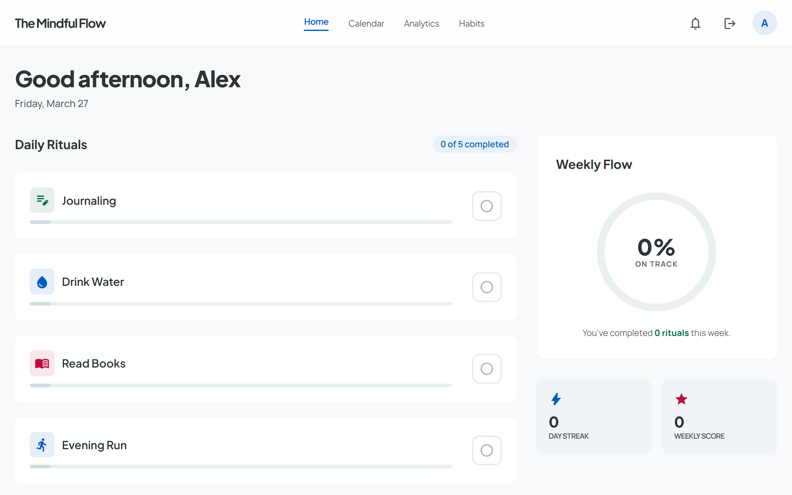
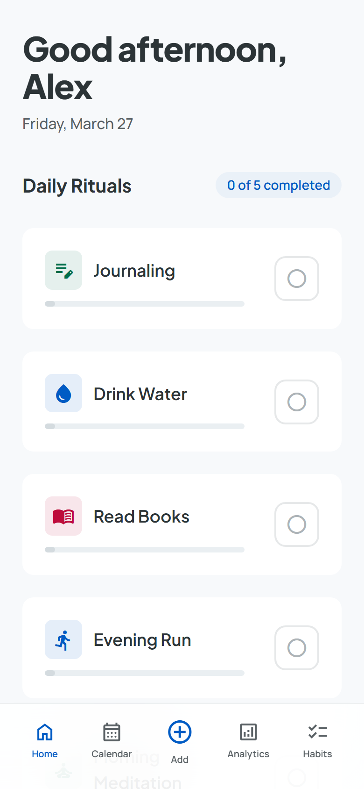
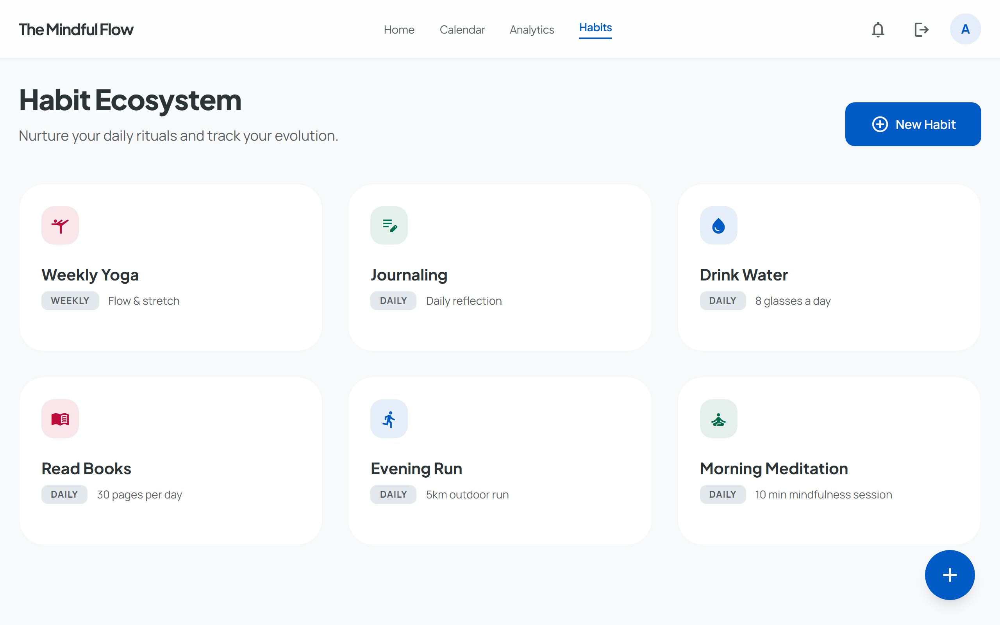
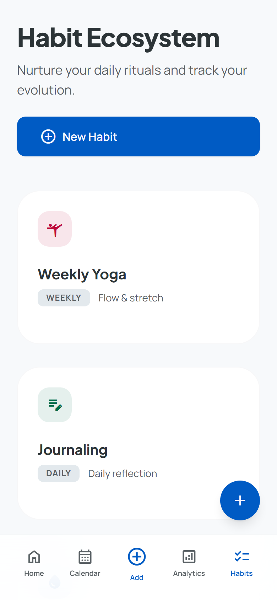
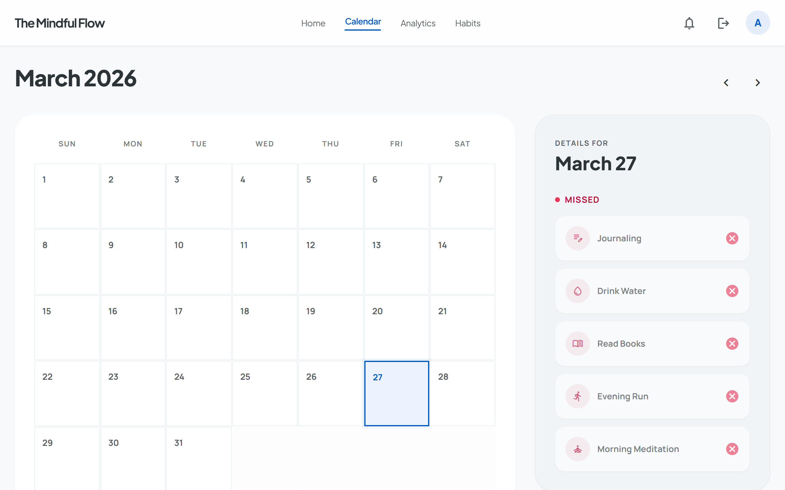
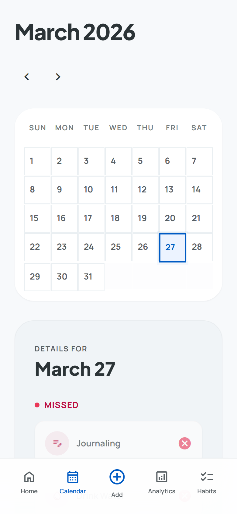
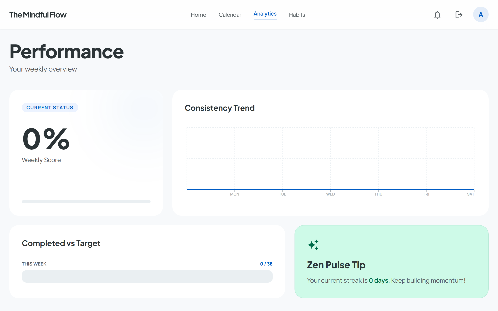
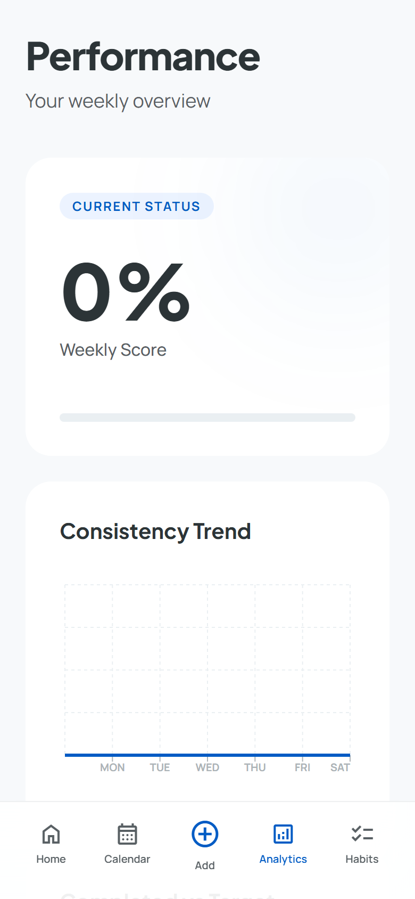
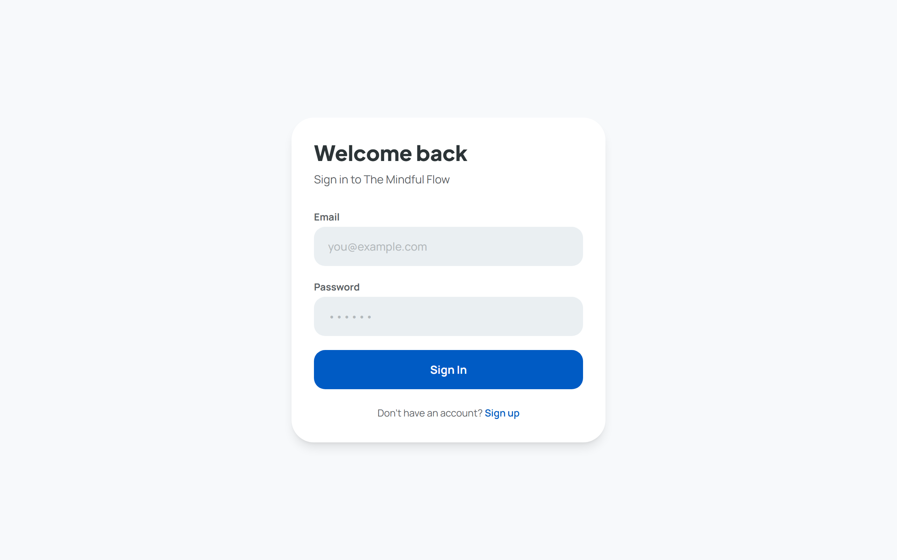
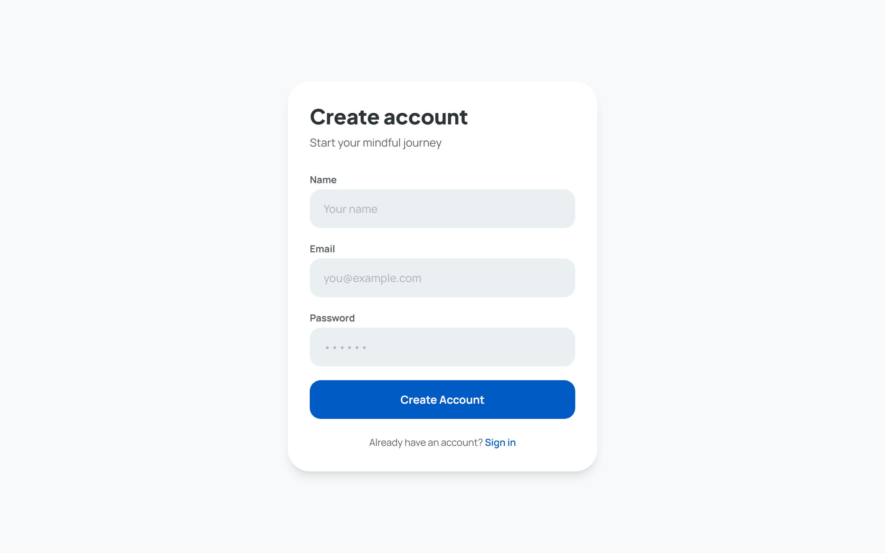

<div align="center">

# The Mindful Flow

**A beautiful, full-stack habit tracker built for calm, consistent progress.**

[](https://react.dev)
[](https://nodejs.org)
[](https://www.mongodb.com)
[](https://tailwindcss.com)
[](https://docs.docker.com/compose)
[](https://pnpm.io)

<br/>



</div>

---

## Overview

The Mindful Flow is a multi-user habit tracking web application that helps you build lasting rituals through gentle progress visualization. Track daily and weekly habits, review your consistency over time on the calendar, and follow your performance trends in the analytics dashboard — all wrapped in a clean, distraction-free UI.

- **Self-hosted** — deploy with a single `docker compose up`
- **Multi-user** — JWT authentication, every user's data is isolated
- **Responsive** — full desktop layout with a purpose-built mobile bottom nav
- **Animated** — smooth Framer Motion transitions, skeleton loading, and progress animations

---

## Features

| | |
|---|---|
| **Daily & weekly habits** | Create habits with custom icons and colors, set daily or weekly targets |
| **One-tap logging** | Check off habits from the dashboard with instant optimistic feedback |
| **Weekly Flow ring** | SVG progress ring showing your on-track percentage for the week |
| **Calendar view** | Browse any month, see completion dots per day, tap a day for full details |
| **Analytics** | Consistency trend chart, completed vs target bar, per-habit breakdown |
| **Notifications** | In-app streak milestones, achievements, and daily Zen tips |
| **Smooth animations** | Page crossfades, staggered card entrances, animated progress bars |
| **Skeleton loading** | Shimmer placeholders on every page during data fetches |

---

## Screenshots

### Dashboard

<table>
  <tr>
    <td></td>
    <td width="35%"></td>
  </tr>
</table>

### Habits

<table>
  <tr>
    <td></td>
    <td width="35%"></td>
  </tr>
</table>

### Calendar

<table>
  <tr>
    <td></td>
    <td width="35%"></td>
  </tr>
</table>

### Analytics

<table>
  <tr>
    <td></td>
    <td width="35%"></td>
  </tr>
</table>

### Auth

<table>
  <tr>
    <td></td>
    <td></td>
  </tr>
</table>

---

## Tech Stack

| Layer | Technology |
|-------|-----------|
| Frontend | React 19 + Vite |
| Styling | Tailwind CSS · Material Design 3 tokens |
| Animations | Framer Motion |
| Charts | Recharts |
| Server state | TanStack Query v5 |
| Backend | Express.js + Mongoose |
| Database | MongoDB 7 |
| Auth | JWT · bcrypt |
| Monorepo | Turborepo + pnpm workspaces |
| Deployment | Docker Compose (nginx + Express + MongoDB) |
| Testing | Jest + Supertest (API) · Playwright (E2E) |

---

## Project Structure

```
tracking-app/
├── packages/
│   ├── client/          # React SPA (Vite)
│   │   └── src/
│   │       ├── components/   # HabitCard, ProgressRing, NavBars, skeletons…
│   │       ├── pages/        # Dashboard, Calendar, Analytics, Habits, Login, Register
│   │       ├── hooks/        # useAuth, useHabits, useCompletions, useNotifications
│   │       └── services/     # Axios instance with JWT interceptor
│   ├── server/          # Express REST API
│   │   └── src/
│   │       ├── routes/       # auth, habits, completions, analytics, notifications
│   │       ├── models/       # User, Habit, Completion, Notification
│   │       └── middleware/   # auth, errorHandler, validate
│   ├── shared/          # Shared validation rules and constants
│   └── e2e/             # Playwright end-to-end tests
├── docker-compose.yml
└── turbo.json
```

---

## Quick Start

### Option 1 — Docker Compose (recommended)

The fastest way to run the full stack with no local dependencies beyond Docker.

```bash
git clone https://github.com/your-username/the-mindful-flow.git
cd the-mindful-flow

cp .env.example .env
# Edit .env and set a strong JWT_SECRET

docker compose up --build
```

| Service | URL |
|---------|-----|
| App | http://localhost:3000 |
| API | http://localhost:5000 |

### Option 2 — Local dev (in-memory MongoDB)

No MongoDB installation required — the dev server spins up an in-memory instance automatically.

**Prerequisites:** Node.js 20+, pnpm 9+

```bash
git clone https://github.com/your-username/the-mindful-flow.git
cd the-mindful-flow

pnpm install

# Start API + client with in-memory MongoDB
pnpm dev:mem
```

| Service | URL |
|---------|-----|
| Client | http://localhost:3000 |
| API | http://localhost:5000 |

### Option 3 — Local dev (external MongoDB)

```bash
cp .env.example .env
# Set MONGO_URI to your MongoDB connection string

pnpm dev
```

---

## Environment Variables

Copy `.env.example` to `.env` and set the values:

```env
MONGO_URI=mongodb://localhost:27017/mindful-flow
JWT_SECRET=your-secret-key-change-in-production
PORT=5000
```

---

## API Reference

All endpoints (except auth) require `Authorization: Bearer <token>`.

| Method | Path | Description |
|--------|------|-------------|
| POST | `/api/auth/register` | Register a new user |
| POST | `/api/auth/login` | Login, receive JWT |
| GET | `/api/auth/me` | Get current user |
| GET | `/api/habits` | List active habits |
| POST | `/api/habits` | Create a habit |
| PUT | `/api/habits/:id` | Update a habit |
| DELETE | `/api/habits/:id` | Archive a habit (soft delete) |
| GET | `/api/completions?date=` | Completions for a day |
| GET | `/api/completions?from=&to=` | Completions for a range |
| POST | `/api/completions` | Log a completion |
| DELETE | `/api/completions/:id` | Remove a completion |
| GET | `/api/analytics/weekly` | Weekly score + day data |
| GET | `/api/analytics/monthly` | Monthly calendar data |
| GET | `/api/analytics/habits/:id` | Per-habit stats |
| GET | `/api/notifications` | List notifications |
| PUT | `/api/notifications/:id/read` | Mark one as read |
| PUT | `/api/notifications/read-all` | Mark all as read |

---

## Testing

### API tests (Jest + Supertest)

Uses an in-memory MongoDB — no external database needed.

```bash
cd packages/server
NODE_ENV=test npx jest --runInBand --forceExit
```

### End-to-end tests (Playwright)

Automatically starts both servers before running.

```bash
cd packages/e2e
npx playwright test
```

---

## Contributing

Contributions are welcome. Please open an issue first to discuss what you'd like to change.

1. Fork the repo
2. Create a feature branch (`git checkout -b feat/your-feature`)
3. Commit your changes
4. Open a pull request

---

## License

MIT
